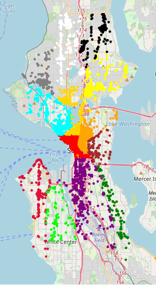
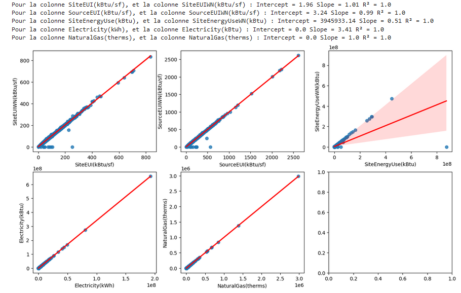
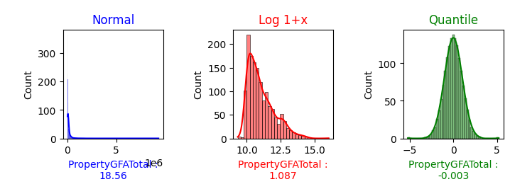
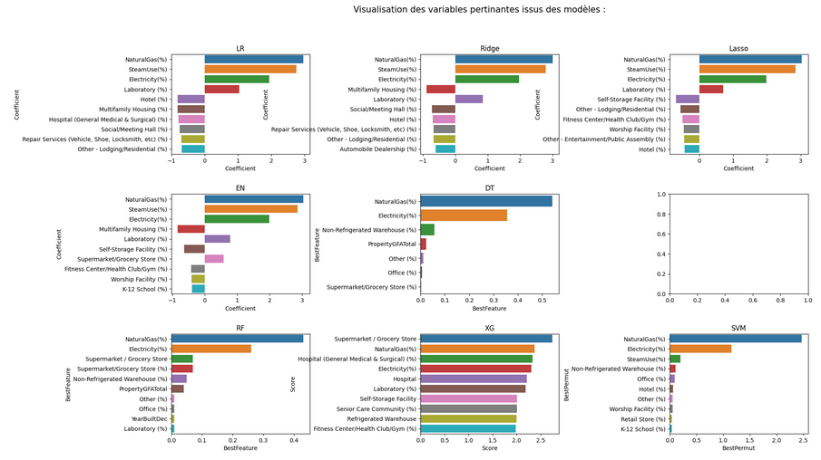
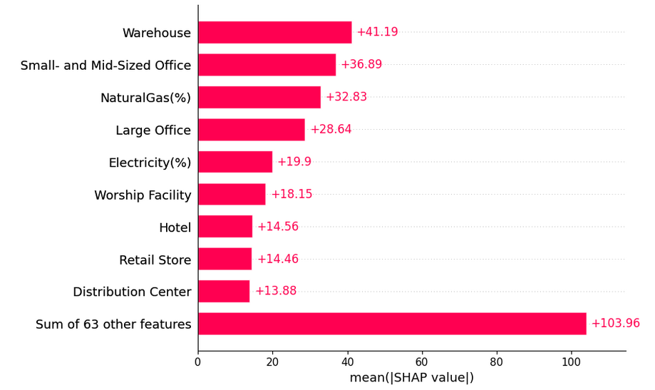

# Projet N°3 : Anticipez les besoins en consommation de bâtiments

## Mise en Situation :
- **Entreprise :** Ville de Seattle
- **Logo :** 
- **But :** ville neutre en émissions de carbone en 2050
- **Jeux de données :** [Les données](https://s3.eu-west-1.amazonaws.com/course.oc-static.com/projects/Data_Scientist_P4/2016_Building_Energy_Benchmarking.csv)
- **Missions :**
    - Etudier la consommation et les émissions des bâtiments non destinés à l’habitation.
    - A partir de données datant de 2016 (taille et usage des bâtiments, date de construction, situation géographique, ...), prédire les émissions de CO2 et la consommation totale d’énergie de bâtiments non destinés à l’habitation pour lesquels elles n’ont pas encore été mesurées.
    - Evaluer l’intérêt de l’"ENERGY STAR Score" pour la prédiction d’émissions, qui est fastidieux à calculer avec l’approche utilisée actuellement par votre équipe. Vous l'intégrerez dans la modélisation et jugerez de son intérêt.
    - Réaliser une courte analyse exploratoire.
    - Tester différents modèles de prédiction afin de répondre au mieux à la problématique.
- **Contraintes :**
    - Utiliser les primo-relevés de consommation pour en déduire des variables structurelles aux bâtiments, par exemple la nature et proportions des sources d’énergie utilisées.. 
    - Trouver de nouvelles informations (peut-on déduire des choses intéressantes d’une simple adresse ?) et optimiser les performances en appliquant des transformations simples aux variables (normalisation, passage au log, etc.).
    - Mettre en place une évaluation rigoureuse des performances de la régression, et optimise les hyperparamètres et le choix d’algorithmes de ML à l’aide d’une validation croisée.
 
## Réalisation :
- **Librairies principales :** Pandas, Numpy, Seaborn, Matplotlib, folium,
- **Etapes réalisées :**
    - **Exploration des données :**
        - Ouvertures des données
        - Analyse du remplissage et informations générales
        - Etudes des variables qualitatives et quantitatives et slice sur les variables et données pertinantes pour la problèmatique (type de propriété, choix des variables de localisation, recherche des outliers et des erreurs)
        - Etude de la localisation des batiments :
          
          
        - Etude des variables de consommation des batiments :
          
          
        - Etude des outliers sur les deux Targets
        - Création de nouvelles variables (Type de batiment, décénies) :
          
          
        - Etude de l'assymètrie des données via le **skew** et modification avec les **quantiles** ou les **log 1+x** :
          
          
          
    - **Prédictions sur les deux Targets :**
        - **Modèles de ML utilisés, optimisations des hyperparamètres :**
            - Random
            - Dummy
            - Régression Linaire (Ridge, Lasso, ElasticNet)
            - DecisionTree (max_depth)
            - KNN (n_neighbors)
            - RandomForest(n_estimator, max_features...)
            - XGBOOST (learning_rate, subsample...)
            - SVM (C_range)
        - **Récupération des mesures intéréssantes :**
            - RMSE
            - R²
            - Durée de run du modèle
        - **Etude des variables importantes :**
            - Via Features Importances ou Coeff :
              
              
            - Via SHAP et LIME :
              
              
